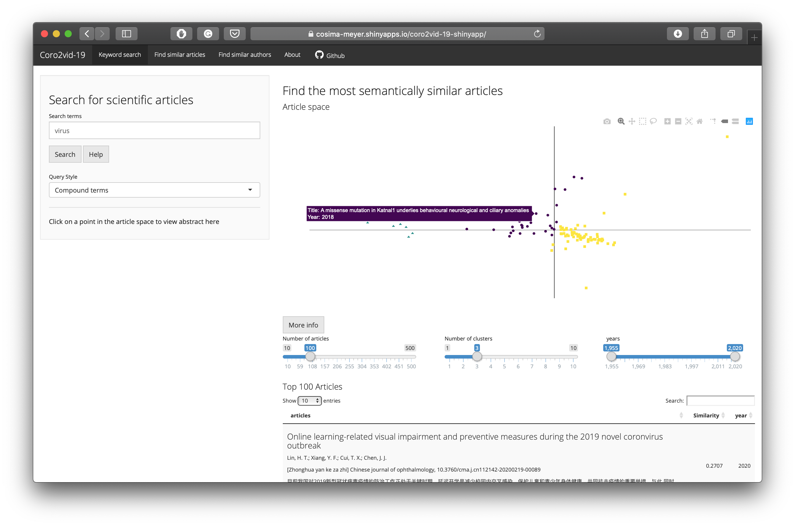

# Coro2vid-19
## Leveraging knowledge about coronaviruses to fight Covid-19

Coro2vid-19 is a search engine that uses academic articles related to **coronavirus**. Our goal is to help users to quickly identify relevant articles on a specific topic using keyword searches as well as to identify related articles and groups of authors. We use the abstract of over 22,000 articles related to coronavirus covering the period from 1955-2020 from [Kaggle](https://www.kaggle.com/allen-institute-for-ai/CORD-19-research-challenge) to find similarities in their content and to construct a ShinyApp. This way, users can explore which articles are most similar to each other. With this ShinyApp, we hope that users can quickly browse through relevant articles and find what they need in order to learn more about the Covid-19 virus. 

**The ShinyApp for our search engine can be found [here](https://cosima-meyer.shinyapps.io/coro2vid-19-shinyapp/).**

The name Coro2vid-19 summarizes this goal: Using information from research on **coro**naviruses **2** helps us understand and fight the current Co**vid-19** virus. 

This project was originally developed through and for the [codevscovid-19 hackathon organized](https://www.codevscovid19.org) by [HackZurich](https://digitalfestival.ch/en/HACK/). You can see all submissions for the hackathon on [Devpost](https://codevscovid19.devpost.com).

## How is the search engine working?

**Keyword Search:** Enter a keyword (such as *virus*) to return the most similar articles to the given keyword. The graph allows the user to modify the number of most similar articles, the number of clusters for the given articles, and the time span in years when the articles are published. The graph itself can further be explored by hovering over the resulting points in the two-dimensional space to see the title of the paper along with its publication date. The table below provides a more detailed overview of the resulting articles by including the abstract as well as the estimated similarity score. Articles can be ranked by this score as well as by the publication year. Finally, the authors of the articles are displayed relative to their respective similarities.

**Find similar articles:** Using the dropdown menu, users can select the title of a specific article and display the relative similarity of a chosen number of other articles. The resulting graph is similar to the one from the keyword search and can thus be modified using different numbers of similar articles to be displayed, vary the number of clusters, and restrict the time span for publication. The table below again shows the top articles along with the similarity score and the respective abstract.

**Find similar authors:** Similar to the *Find similar articles* tab, users can here filter similar authors based on a specific author group. Results are again displayed in both a graph and a table with options to modify the results.

## What did we do to build the Coro2vid-19 search engine?

We used the public [CORD-19 - COVID-19 Open Research Dataset Challenge](https://www.kaggle.com/allen-institute-for-ai/CORD-19-research-challenge) dataset from Kaggle to identify similarities of articles using the information from the abstracts of articles. Put differently, we trained an algorithm to learn the similarity of different words across more than 22,000 abstracts and represent it in a high-dimensional vector space, known as a word-vector space. Based on the similarities of words, we estimate how similar articles and authors are to each other. The resulting Coro2vid-19 search engine is an interactive dashboard for everyone to explore and learn about (and hopefully from) the research of others!

In more technical terms, we used Tensorflow through the keras API in R to construct word embeddings using the standard word2vec pipeline as outlined [here](https://blogs.rstudio.com/tensorflow/posts/2017-12-22-word-embeddings-with-keras/). We end up with 50,000 words from the CORD-19 dataset represented in a 100-dimensional word-vector space. Based on this word-vector space, we used `Doc2vec` from the [textTinyR](https://github.com/mlampros/textTinyR) package to construct an article and author similarities. The resulting graphs and tables show the similarities of articles and authors based on different parameters. Clusters in the resulting graphs are calculated using k-nearest neighbors clustering in R.
For the search engine, we used plotly and Shiny in R. Our deepest and biggest gratitude goes to [Randall Jamieson](https://umcognitivesciencelaboratory.weebly.com), Matt Cook, [Harinder Aujla](http://ion.uwinnipeg.ca/~haujla/) and [Matthew Crump](https://crumplab.github.io) for their fantastic template on [semantic search engines](https://github.com/CrumpLab/SemanticLibrarian). We build heavily on their source code to set up the graphs, tables, and general appearance of the ShinyApp and would like to express our deepest appreciation for their hard work, for making the code publicly available and for their fantastic [SemanticLibrarian](https://semanticlibrarian.shinyapps.io/SemanticLibrarian/) search engine!

## Contributors

Both of us are no experts in the field of virology, biology, or medicine in general. In fact, we are both Ph.D. candidates and researchers in Political Science at the University of Mannheim and thus know about the struggles and difficulties to find important scientific articles that relate to a specific topic of interest. We hope that with this app, fellow researchers that have much more domain knowledge on coronavirus are able to search more quickly and efficiently the relevant articles than using broader search engines for all fields and disciplines.

[Cosima Meyer](https://github.com/cosimameyer) is a Ph.D. candidate and researcher at the University of Mannheim. 

[Dennis Hammerschmidt](https://github.com/dennis-hammerschmidt) is a Ph.D. candidate and research associate at the University of Mannheim.
